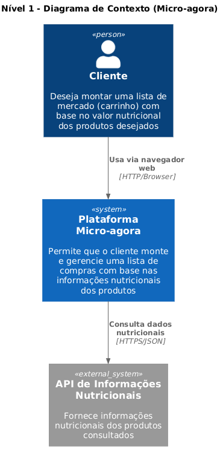
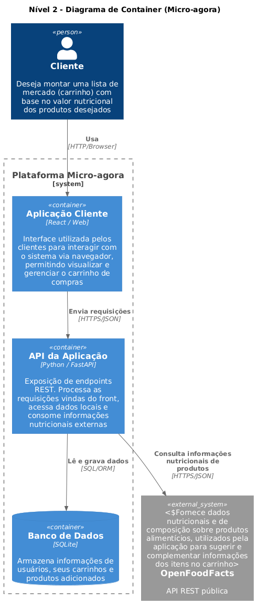
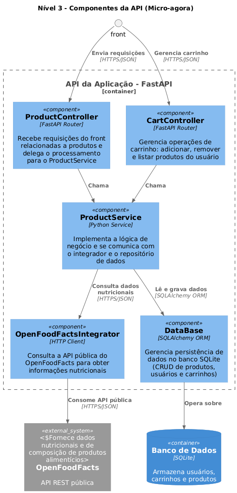

# MC656 - Projeto de Engenharia de Software
Este repositório contém o desenvolvimento de uma API RESTful como parte da disciplina MC656 - Engenharia de Software. O projeto utiliza o framework FastAPI para o back-end e implementa um pipeline de Integração Contínua (CI) com GitHub Actions.
## 🛠️ Tecnologias Utilizadas
- Back-end: Python 3.13
- Framework da API: FastAPI
- Servidor ASGI: Uvicorn
- Testes Automatizados: Pytest
- Qualidade de Código:
  - Flake8 (Linter de Estilo - PEP 8)
  - MyPy (Verificador de Tipos Estáticos)
  - CI/CD: GitHub Actions
## 🚀 Como Executar o Projeto Localmente
Siga os passos abaixo para configurar e executar a aplicação na sua máquina.

**Pré-requisitos:**
- Python 3.13
- pip
1. Clonar o Repositório
```
git clone https://github.com/felipeverol/MC656-Engenharia-de-Software.git
cd MC656-Engenharia-de-Software
```
#
2. Criar um Ambiente Virtual (Recomendado)
É uma boa prática isolar as dependências do projeto.
```
# Criar o ambiente virtual
python -m venv .venv

# Ativar o ambiente virtual no Windows:
.\.venv\Scripts\activate
# No macOS/Linux:
source .venv/bin/activate
```
#
3. Instalar as Dependências
Instale todos os pacotes necessários que estão listados no requirements.txt.
```
pip install -r requirements.txt
```
#
4. Executar a Aplicação
Com as dependências instaladas, inicie o servidor de desenvolvimento.
```
uvicorn app.main:app --reload
```

A API estará disponível no endereço:  ```http://127.0.0.1:8000```
#
5. Aceder à Documentação Interativa
O FastAPI gera automaticamente uma documentação interativa (Swagger UI). Pode usá-la para visualizar e testar os endpoints da API:
```http://127.0.0.1:8000/docs```
#
✅ Testes e Qualidade de Código
O projeto está configurado com um pipeline de CI que executa as seguintes verificações em cada Pull Request para a branch main:
Análise de Estilo (Linting): Garante que o código segue as convenções do PEP 8.
```
flake8 .
```

Verificação de Tipos (Type Checking): Verifica a consistência das anotações de tipo.
```
mypy app
```

Testes Unitários: Executa os testes de lógica da aplicação.
```
pytest
```

Para executar estas verificações localmente, basta rodar os comandos acima no seu terminal.

## 🏛️ Arquitetura do Sistema (MC656 - Parte 4)

Esta seção descreve a arquitetura de software da plataforma "Micro-agora", uma ferramenta de criação e gerenciamento de listas de compras (carrinho) com foco em informações nutricionais.

### Estilo Arquitetural

A arquitetura do projeto adota uma combinação de estilos que promovem a manutenibilidade, testabilidade e um claro desacoplamento de responsabilidades:

1.  **API RESTful:** O estilo primário é uma **API RESTful**. O sistema expõe seus serviços através de *endpoints* HTTP (`/products`, `/cart`, etc.) que utilizam JSON como formato de dados. Esta abordagem foi escolhida para desacopar totalmente o backend (esta aplicação FastAPI) do cliente consumidor (a `Aplicação Cliente` em React/Web).

2.  **Monolítico Modular (Arquitetura em Camadas):** Internamente, a aplicação **FastAPI** segue um padrão de **Monolítico Modular**. Embora todo o código seja implantado como um único processo (monolito), ele é logicamente organizado em componentes com responsabilidades distintas (Controladores, Serviços, Integradores e Repositórios), como detalhado no diagrama de Nível 3.

### Diagramas C4

A seguir, são apresentados os diagramas C4 (Contexto, Container e Componentes) para ilustrar a arquitetura do "Micro-agora" em diferentes níveis de detalhe.

#### Nível 1: Diagrama de Contexto

Este diagrama trata o sistema "Micro-agora" como uma "caixa-preta". Ele ilustra como o `Cliente` interage com a plataforma (através de um `Navegador web`) e como o sistema depende de uma `API de Informações Nutricionais` externa para sua funcionalidade principal.



#### Nível 2: Diagrama de Container

Este diagrama dá um "zoom" no Sistema "Micro-agora", mostrando os principais "containers" (peças tecnológicas implantáveis) que o compõem. Ele revela a divisão entre o front-end (`Aplicação Cliente`), o back-end (`API da Aplicação`) e o banco de dados (`SQLite`), além da sua interação com o sistema externo `OpenFoodFacts`.



#### Nível 3: Diagrama de Componentes da API

Este diagrama detalha os principais componentes (módulos de código) *dentro* do container `API da Aplicação - FastAPI`. Ele mostra como a lógica de negócio da API está estruturada internamente e como as responsabilidades são distribuídas.



### Principais Componentes e suas Responsabilidades

Com base no Diagrama de Componentes (Nível 3), estes são os principais módulos da `API da Aplicação (FastAPI)` e suas responsabilidades:

* **ProductController** (`FastAPI Router`):
    * *Responsabilidade:* Recebe as requisições HTTP do front-end relacionadas a produtos. Atua como a camada de entrada, validando requisições e delegando o processamento para o `ProductService`.
* **CartController** (`FastAPI Router`):
    * *Responsabilidade:* Gerencia as operações de carrinho. Recebe requisições para adicionar, remover e listar produtos do carrinho de um usuário, orquestrando a lógica através do `ProductService`.
* **ProductService** (`Python Service`):
    * *Responsabilidade:* É o "coração" da lógica de negócio. Implementa as regras de negócio, coordena a busca de dados nutricionais (chamando o `OpenFoodFactsIntegrator`) e a persistência de dados (chamando o componente `DataBase`).
* **OpenFoodFactsIntegrator** (`HTTP Client`):
    * *Responsabilidade:* Atua como um *Adaptador* (Adapter). Encapsula toda a lógica de comunicação com a API pública externa do OpenFoodFacts. É responsável por fazer a chamada HTTP, tratar a resposta (JSON) e fornecer os dados nutricionais de forma limpa para o `ProductService`.
* **DataBase** (`SQLAlchemy ORM`):
    * *Responsabilidade:* Atua como a camada de Repositório (Repository). Gerencia a persistência de dados no banco `SQLite`. É responsável por todo o CRUD (Create, Read, Update, Delete) de produtos, usuários e carrinhos, abstraindo a lógica SQL do resto da aplicação.
