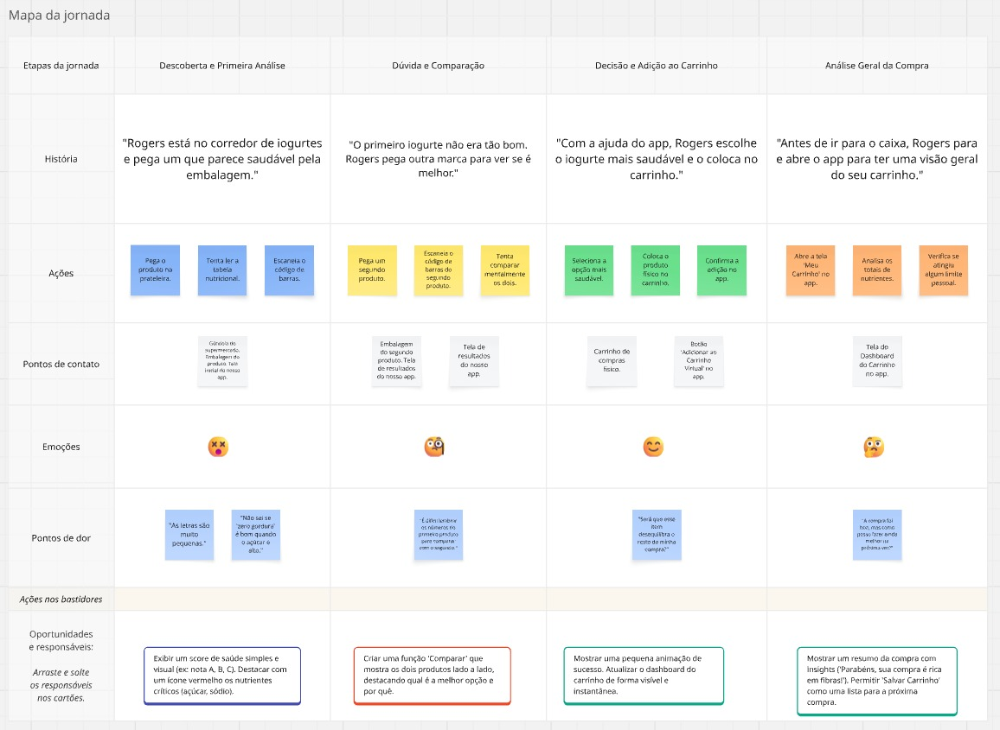
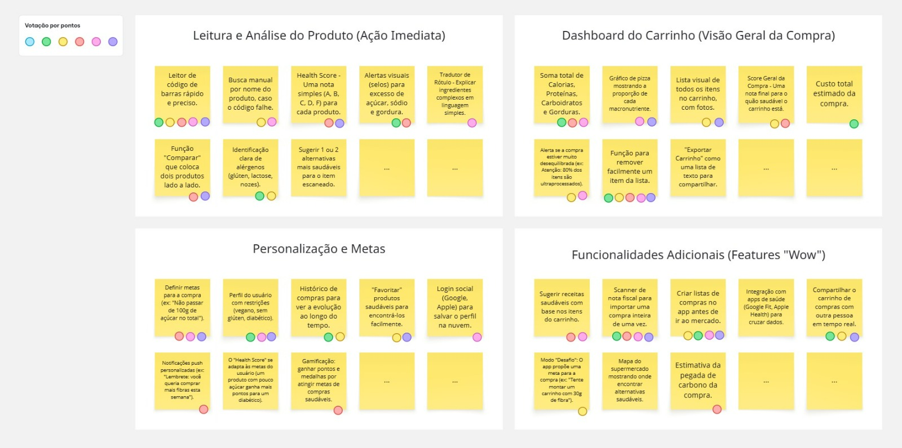

# Relatório de Elicitação de Requisitos - Avaliação A3

**Projeto:** Carrinho de Compras Saudáveis

## Introdução

Este documento apresenta os resultados do processo de elicitação de requisitos para o projeto "Carrinho de Compras Saudáveis". O objetivo desta etapa foi investigar e compreender as necessidades, dores e expectativas dos usuários-alvo para garantir que o desenvolvimento do produto seja orientado a valor, focando em funcionalidades que resolvem problemas reais. Para isso, foram empregadas duas técnicas complementares: Mapeamento da Jornada do Usuário e Brainstorming.

---

## Técnica 1: Mapeamento da Jornada do Usuário (User Journey Mapping)

**Data da Execução:** 09/10/2025

**Participantes:** Felipe Verol, Gabriel dos Santos, Pedro Ascef, Vinícius Borges, Theo Maceres

### Descrição do Processo
Para obter uma compreensão empática e profunda do contexto de uso do nosso aplicativo, desenvolvemos um mapa da jornada do usuário. Esta técnica nos permitiu visualizar a experiência de uma pessoa tentando realizar compras mais saudáveis no supermercado, identificando suas ações, sentimentos, frustrações (pontos de dor) e as oportunidades onde nossa solução pode intervir positivamente.

### Perfil da Persona
- **Nome:** Rogers
- **Idade:** 50 anos
- **Ocupação:** Profissional com rotina agitada.
- **Objetivo:** Adotar uma alimentação mais saudável e consciente.
- **Frustrações:** Sente-se confuso e sobrecarregado com a complexidade dos rótulos nutricionais, desconfia do marketing de produtos fit e gasta muito tempo no mercado tentando fazer boas escolhas.

### Cenário (Objetivo da Jornada)
Rogers vai ao supermercado para fazer as compras da semana com a meta de escolher produtos com baixo teor de açúcar, sódio e gorduras processadas.

### Evidência (Mapa da Jornada)
O mapa visual abaixo ilustra as etapas da jornada da Mariana, desde a escolha de um produto na prateleira até a análise final de seu carrinho. As oportunidades identificadas neste mapa foram a principal fonte de inspiração para a criação dos épicos e histórias de usuário.

---

## Técnica 2: Brainstorming

**Data da Execução:** 09/10/2025
**Participantes:** Felipe Verol, Gabriel dos Santos, Pedro Ascef, Vinícius Borges, Theo Maceres

### Descrição do Processo
Com base nos insights e oportunidades levantados na Jornada do Usuário, a equipe realizou uma sessão de brainstorming estruturado utilizando a ferramenta Miro. A sessão teve como pergunta central: "Como podemos transformar as dores do Rogers em funcionalidades que gerem confiança e facilitem decisões saudáveis?". As ideias foram geradas livremente e, em um segundo momento, agrupadas em categorias temáticas, que serviram como base para a estruturação dos épicos do projeto.

### Evidência (Resultado do Brainstorming)
A imagem a seguir é um registro do quadro de brainstorming ao final da sessão, exibindo as ideias geradas e sua clusterização em temas como "Análise Instantânea de Produto", "Dashboard do Carrinho" e "Personalização e Metas".

## Conclusão da Elicitação

O uso combinado do Mapeamento da Jornada do Usuário e do Brainstorming nos proporcionou uma base sólida de requisitos centrados no usuário. As evidências coletadas permitiram identificar as funcionalidades de maior valor e priorizá-las de forma estratégica, garantindo que o desenvolvimento inicial do produto ataque diretamente as dores mais significativas do nosso público-alvo.
